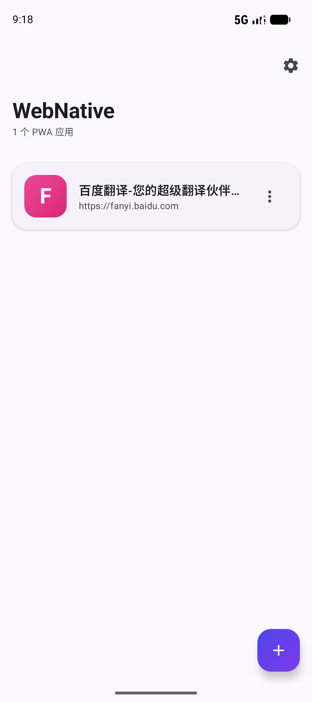
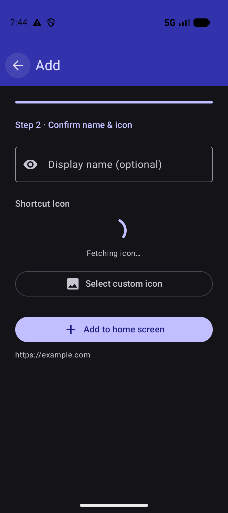
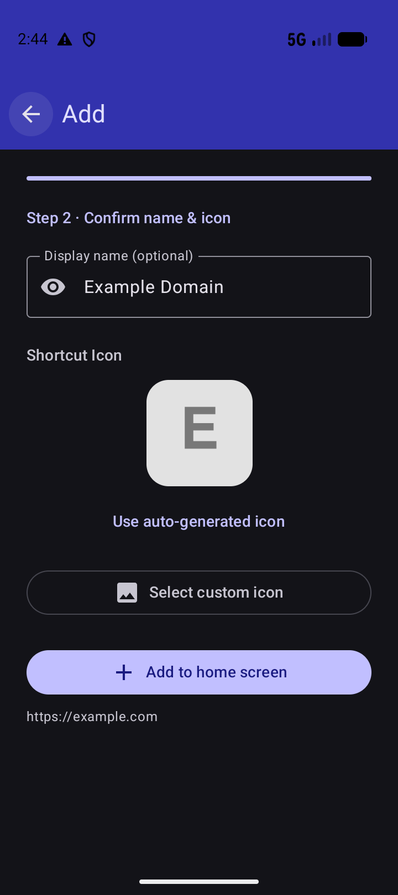
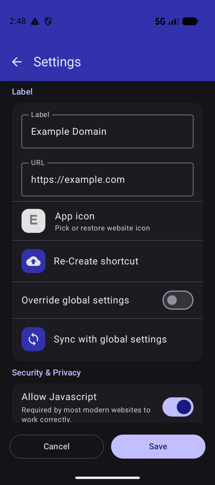
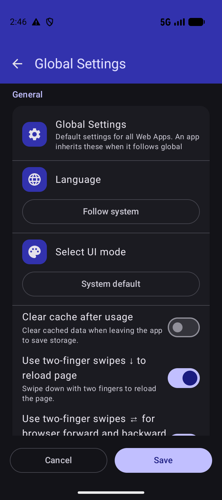
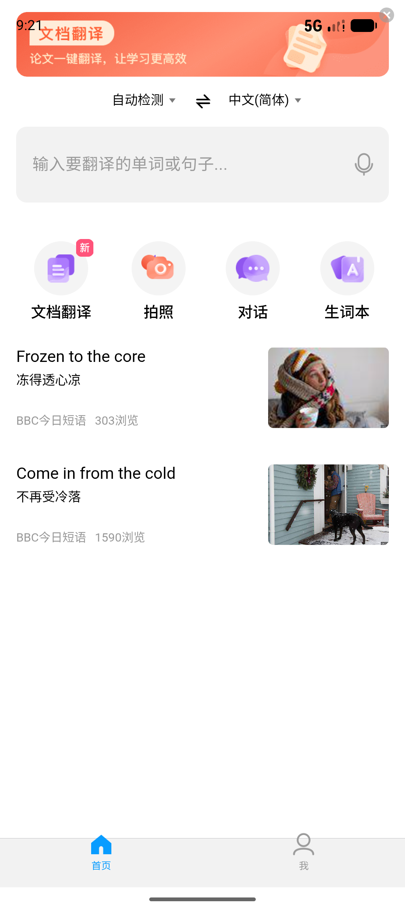
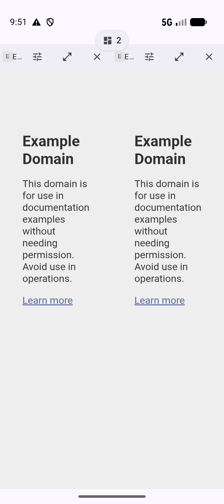

# WebNative


**为 PWA 而生的轻量 Web App 套壳**——把任意网站变成全屏、免打扰的原生应用体验。专为高频文本流场景（如 AI 对话、代码生成）做了严苛的渲染优化。

## Features

* **PWA 专用渲染优化**：渲染进程智能降载（后台自动让出资源）、硬件加速、文字 1:1 保真、预栅格化——流式文本输出流畅清晰
* **自定义地址**：两步向导添加（输入 URL → 自动识别标题/图标 → 完成），可自定义显示名称
* **动态图标**：自动拉取站点 favicon，失败时生成优雅的渐变首字母图标（也支持手动上传图片）
* **靛蓝主题**：Material 3 靛蓝配色（seed #4F46E5），支持深色模式，全应用 Compose 卡片化 UI
* **桌面快捷方式**：一键创建主屏幕直达入口
* **中英双语**：默认中文，设置内一键切换（跟随系统 / 中文 / English）
* **全屏沉浸**：edge-to-edge，状态栏/导航栏与页面融合
* **每站独立设置**：JavaScript、Cookies、桌面 UA、深色模式、自动刷新等按 Web App 单独配置
* **多窗矩阵**：同屏 2-6 个站点并行（按设备内存动态分档），拖拽排序、单窗原地放大、格内页面/字体缩放；崩溃自动批量恢复、内存不足自动降级，页面加载前预计算设备容量防崩溃
* **矩阵全屏满铺 + 可移动窗数胶囊**：窗口零间隙铺满可用区域（状态栏/导航条保留）；全局控制收进一枚可拖动胶囊——自由摆放、贴边隐藏、点开即出「窗数步进 + 退出」快捷菜单，挂机 2 秒自动吸附收纳
* **应用内扫码**：主页扫码（CameraX 相机栈 + 品牌化取景框）——扫到 `webnative://add` 一键添加为应用，扫到 http/https 直接进页面浏览（不注册站点）
* **站点分享**：把任意站点连同全部设置打成二维码/深链（`webnative://add`，差异编码只带非默认项），对方扫一下即进添加向导；新设置字段自动纳入分享，无需追补；fail-closed 校验（版本门/URL 白名单/userinfo 剥离）
* **站点健康**：本会话内加载失败的站点在列表与矩阵选站面板标注「最近加载失败」；加载失败按证书/地址/瞬态分类，仅瞬态走断线自动重连
* **网页事件提醒**：把网页事件转成手机系统通知/Toast——网页通知拦截、标题变化、元素出现三类触发器，三步大白话向导配置，支持按站静音；例：AI 任务完成自动提醒
* **多手势导航**：双指前进/后退、双指下滑刷新、三指切换；屏幕边缘左右滑前进/后退为可选项（设置内开启，默认关闭）
* **安全加固**：文件/内容访问、混合内容、JS 弹窗、Safe Browsing 五重防护（全局+每站两级，默认全开）
* **按站统计**：打开次数、加载耗时分布、缓存占用、错误日志——独立统计页（KPI 卡 + 图表），支持导入/导出
* **组合快捷键**：手机点选录入（Ctrl/Shift/Alt + 主键），小菜单一键发送到页面，不触发浏览器默认
* **应用错误日志**：崩溃兜底记录 + 导出近 3 天日志（全局设置备份区）
* **数据备份**：版本化 JSON 导出/导入（含校验和验证）
* **极低损耗**：R8 全量压缩，仅保留 arm64-v8a 原生库，release APK 实测约 5.0MB（v2.2.12 引入 CameraX 扫码）；无 GMS 依赖；敏感权限（相机/麦克风/定位）不在启动时索取，仅网页功能触发时按需向用户申请

## Tech Stack

| 组件               | 版本                                                                     |
|--------------------|--------------------------------------------------------------------------|
| Kotlin             | 2.3.20（built-in Kotlin）                                                |
| Compose            | Material 3 + BOM 2026.06.01                                              |
| AGP                | 9.3.1                                                                    |
| Gradle             | 9.7.0                                                                    |
| minSdk / targetSdk | 31 / 37                                                                  |
| 持久化             | DataStore（错误日志/统计）+ Gson + SharedPreferences（WebApp 列表/设置） |

## Build

```bash
# Debug（可安装调试）
./gradlew assembleDebug

# Release（需 key.properties，无则回退 debug 签名）
./gradlew assembleRelease
```

依赖版本统一管理于 `gradle/libs.versions.toml`（Version Catalog）。

## Release (CI)

打 tag 自动触发 GitHub Actions 发版（签名 APK + AAB → GitHub Release）：

```bash
git tag -a v2.2.21 -m "v2.2.21"
git push origin v2.2.21
```

首次需在仓库 Settings → Secrets 配置：`KEYSTORE_BASE64` / `KEYSTORE_PASSWORD` / `KEY_ALIAS` / `KEY_PASSWORD`。

## FAQ

<details>
<summary><i> Q: 为什么需要这个应用？手机浏览器不也能做到吗？ </i></summary>
A: 浏览器创建的主屏幕快捷方式只有站点提供 PWA manifest 时才能全屏沉浸。WebNative 对任意网站都能做到，且可以为不同网站设置不同配置（桌面 UA、深色模式、自动刷新等）。
</details>

<details>
<summary><i> Q: 为什么针对文本流做了专门优化？ </i></summary>
A: AI 对话/代码生成类页面是高频流式文本渲染（逐字输出、长文档、代码块），对 WebView 渲染性能要求苛刻。WebNative 通过渲染进程优先级管理（Chromium 推荐方案）、硬件加速、预栅格化等配置确保这类场景流畅清晰。
</details>

<details>
<summary><i> Q: 这是独立浏览器引擎吗？ </i></summary>
A: 不是。基于系统内置 Android WebView 渲染，无自带引擎、无 GMS 依赖。
</details>

<details>
<summary><i> Q: 最低支持什么 Android 版本？ </i></summary>
A: Android 12（API 31）及以上。
</details>

## Notable used libraries

* [AndroidX WebKit](https://developer.android.com/jetpack/androidx/releases/webkit) — WebView 现代化能力
* [Jetpack Compose (Material 3)](https://developer.android.com/jetpack/compose) — UI
* [CameraX](https://developer.android.com/jetpack/androidx/releases/camera) — 应用内扫码相机栈
* [ZXing core](https://github.com/zxing/zxing) — 二维码生成与解码
* [Gson](https://github.com/google/gson) — 数据持久化
* [JSoup](https://jsoup.org/) — favicon/标题抓取
* [Vico Compose M3](https://github.com/patrykandpatrick/vico) — 统计图表
* [Markwon](https://github.com/noties/Markwon) — Markdown 渲染（更新日志）

完整开源库依赖声明见 `app/build.gradle` 与 [gradle/libs.versions.toml](gradle/libs.versions.toml)。

## Screenshots

|              主界面               |              添加向导 · 第一步               |              添加向导 · 第二步               |
|:---------------------------------:|:--------------------------------------------:|:--------------------------------------------:|
|  |  |  |

|                       Web App 设置                       |                        全局设置                         |                浏览页面                 |
|:--------------------------------------------------------:|:-------------------------------------------------------:|:---------------------------------------:|
|  |  |  |

|                       多窗矩阵 · 全屏满铺 + 可移动窗数胶囊                        |
|:--------------------------------------------------------------------------------:|
|  |

> 截图基于 Android 模拟器（Pixel 9a, API 37）实测采集。

## Credits & License

WebNative 基于 [cylonid](https://github.com/cylonid) 的自由软件项目
[Native Alpha](https://github.com/cylonid/NativeAlphaForAndroid) 深度修改而来：

* **Native Alpha（上游）** — Copyright © cylonid 及其贡献者，本项目继承的全部上游代码
* **WebNative（修改部分）** — Copyright © 2026
  [fc6a1b03](https://github.com/fc6a1b03)，自 2026-08-19 起的持续重写：Jetpack
  Compose 全面重建 UI、多窗矩阵、网页事件提醒、应用内扫码、文本流渲染优化等

作为上游的修改版本，本项目依 GPL-3.0 第 5 条声明上述修改，并继续以
**GNU GPL v3 或（你自选的）任意更高版本**整体授权（完整许可证文本见
[LICENSE](LICENSE)）。你可以自由地使用、学习、分享和改进本程序：

> This program is free software: you can redistribute it and/or modify it
> under the terms of the GNU General Public License as published by the Free
> Software Foundation, either version 3 of the License, or (at your option)
> any later version.

本程序按「现状」分发，不附带任何形式的担保（详见 LICENSE 第 15~17 条）；
再分发时须同样遵循 GPL-3.0，包括提供对应源代码。向 Native Alpha
的原作者与所有贡献者致谢。
